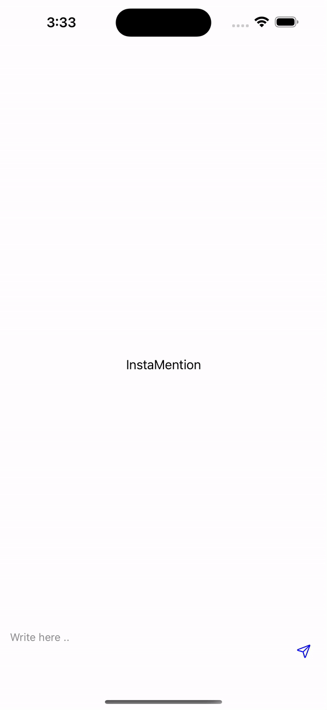

# InstaMention
InstaMention is a dynamic iOS application designed to enhance chat experiences by allowing users to mention others easily. This README provides guidance on how to use the key features of the application.

## Features
- **Dynamic Mentioning**: Easily mention users in chat by typing "@" followed by their username.
- **User Mentions Display**: When a user starts typing a mention, a list of matching usernames is displayed for quick selection.
- **Responsive Interface**: The application updates the mention suggestions in real-time as the user types.

1. Clone the repository:
   ```bash
   git clone https://github.com/yourusername/InstaMention.git
   cd InstaMention
2. Open the project in Xcode.
3. Build and run the application on your simulator or device.

## Usage
1. Start a Chat: Navigate to the chat interface within the app.
2. Mention a User:
    * Start typing a message in the chat input field.
    * Type @ followed by the username of the person you want to mention.
    * A list of matching usernames will appear. Select the desired username from the list.
3. Implement MentionManager: To enable the mention feature, initialize the MentionManager in your view controller:
    ```swift
    mentionManager = MentionManager(textView: self.tvMessage, mentionArray: DummyData.shared.setDummyData())
    mentionManager.delegate = self
4. Handle User Selection: Implement the MentionManagerDelegate to handle the selected user’s ID and username:
   ```swift
   extension ViewController: MentionManagerDelegate {
    func didSelectMention(username: String, id: String) {
        print("Selected Mention: \(username) with ID: \(id)")
        self.arrAddedUsers.append(MentionUserModel(id: Int(id) ?? 0, userName: username))
        // Handle the selected mention, e.g., update UI, perform an action, etc.
      }
    }

5. Send Messages: Once you finish typing your message (with or without mentions), tap the send button to deliver your message to the chat.

## Demo



# Contributing
Contributions are welcome! Please create a pull request or open an issue for any enhancements or bug fixes.

# License
This project is licensed under the MIT License. See the LICENSE file for details.

Feel free to modify any part of this as needed!


